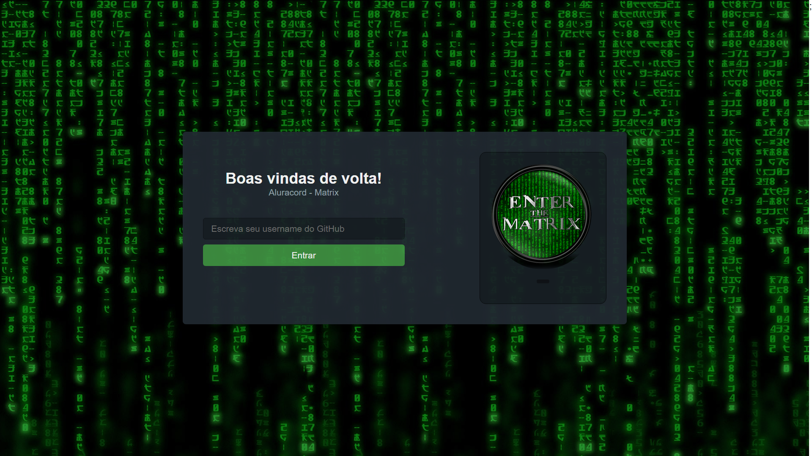

# 💻 Aluracord - Matrix (In Development)

<h1 align="center">
    
</h1>

<p align="center">
  <a href="#technologies">Technologies</a>&nbsp;&nbsp;&nbsp;|&nbsp;&nbsp;&nbsp;
  <a href="#-project">Getting started</a>&nbsp;&nbsp;&nbsp;|&nbsp;&nbsp;&nbsp;
  <a href="#-project">Project</a>&nbsp;&nbsp;&nbsp;|&nbsp;&nbsp;&nbsp;
  <a href="#-preview">Preview</a>&nbsp;&nbsp;&nbsp;|&nbsp;&nbsp;&nbsp;
  <a href="#-layout">Layout</a>&nbsp;&nbsp;&nbsp;|&nbsp;&nbsp;&nbsp;
  <a href="#-license">License</a>
</p>

<p align="center">
  
  
  

  
</p>

---

## 🧪 Technologies

This project was developed using the following technologies:

- [React](https://reactjs.org)
- [JavaScript](https://www.javascript.com)
- [SkynexUI](https://skynexui.dev)
- [Supabase](https://app.supabase.io/)
- [Emotion](https://emotion.sh/docs/introduction)

## 🚀 Getting started

Clone the project and access the folder

```bash
$ git clone https://github.com/jose-bone/aluracord-matrix.git && cd aluracord-matrix
```

Follow the steps below

```bash
# Install the dependencies
$ yarn install

# Start the project
$ yarn dev
```

## 💻 Project

Project developed during Alura's React Immersions with the purpose to learn ReactJs and NextJs and improve my knowledge - check it out clicking the link bellow
<ttps://aluracord-jose-bone.vercel.app>

This project is being developed during Alura's "Imersão React"
[@alura](https://github.com/alura)
[@omariosouto](https://github.com/omariosouto)
[@peas](https://github.com/peas)

## 🧪 Preview


## 🔖 Layout

You can view the project layout through the links below:

- [Layout](<https://www.figma.com/file/Z74n1Mr4ZGlS63g1hCnFZ9/Imers%C3%A3o-React---Aluracord---Matrix-(Copy)?node-id=0%3A1>)

Remembering that you need to have a [Figma](http://figma.com/) account to access it.

## 📝 License

This project is licensed under the MIT License. See the [LICENSE](LICENSE.md) file for details.

---

Made with 💜 by [José Boné](https://github.com/jose-bone) 👋
